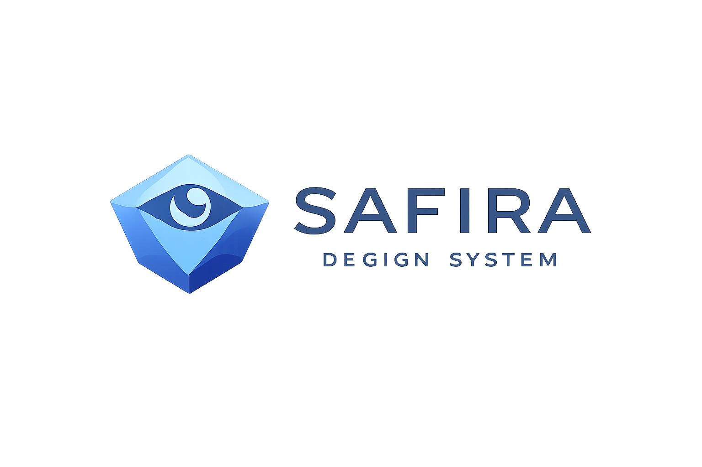

<p align="center">
  
</p>

<p align="center">
  <strong>Uma biblioteca de componentes React moderna, acessível e altamente customizável.</strong>
</p>

<p align="center">
  
  
  
  
  
</p>

---

# 💎 Safira UI

Uma biblioteca de componentes React moderna, acessível e altamente customizável, construída com TypeScript e Material-UI.

## ✨ Características

- 🎨 **Design System Consistente** - Tokens de design padronizados para cores, tipografia e espaçamentos
- 🌙 **Tema Claro/Escuro** - Suporte nativo a múltiplos temas
- ♿ **Acessibilidade** - Componentes desenvolvidos seguindo as diretrizes WCAG
- 📱 **Responsivo** - Componentes adaptáveis a diferentes tamanhos de tela
- 🧪 **Testado** - Cobertura de testes com Jest e Testing Library
- 📚 **Documentação** - Storybook com exemplos interativos
- 🔧 **TypeScript** - Tipagem completa para melhor DX

## 📦 Componentes

| Componente | Descrição |
|------------|-----------|
| `Alert` | Mensagens de feedback com diferentes severidades (success, warning, error, info) |
| `Badge` | Indicadores visuais para status ou contagem |
| `Button` | Botões com variantes, tamanhos e estados |
| `Card` | Containers para agrupar conteúdo relacionado |
| `Input` | Campos de entrada de texto com validação |
| `Modal` | Diálogos modais para interações focadas |
| `Select` | Seleção de opções em dropdown |
| `Tooltip` | Dicas contextuais ao passar o mouse |

## 🚀 Início Rápido

### Pré-requisitos

- Node.js 18+
- npm ou yarn

### Instalação

```bash
# Clonar o repositório
git clone https://github.com/pprimon/safira-ui.git
cd safira-ui

# Instalar dependências
npm install
```

### Scripts Disponíveis

```bash
# Desenvolvimento
npm run dev              # Inicia o servidor de desenvolvimento

# Storybook
npm run storybook        # Inicia o Storybook na porta 6006
npm run build-storybook  # Compila o Storybook para produção

# Testes
npm run test             # Executa os testes
npm run test:watch       # Executa testes em modo watch
npm run test:coverage    # Gera relatório de cobertura

# Build
npm run build            # Compila para produção
npm run preview          # Visualiza o build de produção

# Linting
npm run lint             # Verifica problemas de código
```

## 🎨 Design Tokens

A biblioteca utiliza um sistema de tokens para garantir consistência visual:

### Cores

```typescript
// Cores principais
primary:    '#9472C8'  // Roxo principal
secondary:  '#572F93'  // Roxo escuro
accent:     '#EBE54B'  // Amarelo destaque
surface:    '#D2CF89'  // Bege claro
background: '#3F3E33'  // Marrom escuro
```

### Uso com ThemeProvider

```tsx
import { ThemeProvider } from './theme';
import { Button, Alert } from './components';

function App() {
  return (
    <ThemeProvider>
      <Alert severity="success" title="Sucesso!">
        Operação realizada com sucesso.
      </Alert>
      <Button variant="contained" color="primary">
        Clique aqui
      </Button>
    </ThemeProvider>
  );
}
```

## 📖 Documentação

Execute o Storybook para ver a documentação interativa completa:

```bash
npm run storybook
```

Acesse [http://localhost:6006](http://localhost:6006) para explorar todos os componentes com exemplos de uso, variantes e controles interativos.

## 🧪 Testes

Os testes são escritos com Jest e Testing Library:

```bash
# Executar todos os testes
npm run test

# Executar com cobertura
npm run test:coverage

# Modo watch para desenvolvimento
npm run test:watch
```

## 📁 Estrutura do Projeto

```
safira-ui/
├── src/
│   ├── components/          # Componentes da biblioteca
│   │   ├── Alert/
│   │   │   ├── Alert.tsx
│   │   │   ├── Alert.theme.ts
│   │   │   ├── Alert.stories.tsx
│   │   │   ├── Alert.mdx
│   │   │   └── __tests__/
│   │   ├── Badge/
│   │   ├── Button/
│   │   ├── Card/
│   │   ├── Input/
│   │   ├── Modal/
│   │   ├── Select/
│   │   └── Tooltip/
│   ├── theme/               # Configuração de tema
│   │   ├── tokens.ts        # Design tokens
│   │   ├── theme.ts         # Tema MUI customizado
│   │   └── ThemeProvider.tsx
│   └── types/               # Tipos TypeScript compartilhados
├── jest.config.js           # Configuração do Jest
├── vite.config.ts           # Configuração do Vite
└── package.json
```

## 🛠️ Tecnologias

- **React 18** - Biblioteca UI
- **TypeScript** - Tipagem estática
- **Material-UI 7** - Base de componentes
- **Emotion** - CSS-in-JS
- **Vite** - Build tool
- **Storybook 8** - Documentação de componentes
- **Jest 30** - Framework de testes
- **Testing Library** - Utilitários de teste

---

<p align="center">
  Feito com 💜 por <a href="https://github.com/pprimon">Priscila Primon</a>
</p>
